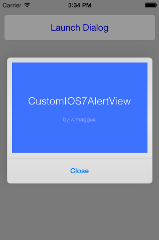

# Custom iOS7 AlertView

The `addSubview` method is not available in `UIAlertView` in iOS7 any more. The view hierarchy for this class is private and must not be modified.

As a solution, this class creates an iOS7-style AlertView for which you can supply your own buttons and `UIView` for the content. The animations and the looks are copied too and no images or other resources are needed.



## Installation

It's as simple as adding the following file to your project:

* [CustomIOS7AlertView.swift](CustomIOS7AlertView.swift)

## Support

Only iOS 7 and newer.

## Quick start guide

1. Create a CustomIOS7AlertView instance:

```
let alertView = CustomIOS7AlertView()
```

2. Add some custom content to the alert view:

```
alertView.containerView = UIView(...)
```

3. Set a callback

Using a delegate: (see the [properties](#properties) for the protocol)

```
alertView.delegate = self
```

Or a closure:

```
alertView.onButtonTouchUpInside = {
  (alertView: CustomIOS7AlertView, buttonIndex: Int) -> Void in

  println("Closure says: Button with index \(buttonIndex) has been touched!")
}
```

4. Display the alertView:

```
alertView.show()
```

## Functions

* `show()` Shows the alertView
* `show(completion: ((Bool) -> Void)?)` Shows the alertView then runs `completion`

* `close()` Closes the alertView
* `close(completion: ((Bool) -> Void)?)` Closes the alertView then runs `completion`

* `setButtonEnabled(enabled: Bool, buttonName: String)` Enables or disables a button. Make sure you call this after `show()`

## <a name="properties"></a>Properties

* `buttonHeight: CGFloat` The height of the buttons. Default: `50`
* `buttonsDividerHeight: CGFloat` The height of the buttons divider. Default: `1`
* `cornerRadius: CGFloat` The radius of the alert view. Default: `7`

* `useMotionEffects: Bool` Whether to use motion effects or not. Default: `true`
* `motionEffectExtent: Int` The extent of the motion effects. Default: `10`

* `containerView: UIView!` The custom view to show. By default this is an empty view.

* `buttonTitles: [String]?` An array of strings. Each string will be a button. Default: `["Close"]`
* `buttonColor: UIColor?` The color of the buttons in normal state. By default this is the `UIButton`'s default `tintColor`
* `buttonColorHighlighted: UIColor?` The color of the buttons in normal state. By default this the same as `buttonColor` but with an alpha of `0.5`

* `delegate: CustomIOS7AlertViewDelegate?` A delegate that implements the `CustomIOS7AlertViewDelegate` protocol below. `nil` by default.

```
protocol CustomIOS7AlertViewDelegate: class {
  func customIOS7AlertViewButtonTouchUpInside(alertView: CustomIOS7AlertView, buttonIndex: Int)
}
```

* `onButtonTouchUpInside: ((alertView: CustomIOS7AlertView, buttonIndex: Int) -> Void)?` A closure that is called when a button is touched. `nil` by default.

## License

**Please feel free to push back anything you think is useful for the project.**

Copyright (c) 2013 Richard Dancsi

Lincesed under [The MIT License](http://opensource.org/licenses/MIT) (MIT)

Permission is hereby granted, free of charge, to any person obtaining a copy
of this software and associated documentation files (the "Software"), to deal
in the Software without restriction, including without limitation the rights
to use, copy, modify, merge, publish, distribute, sublicense, and/or sell
copies of the Software, and to permit persons to whom the Software is
furnished to do so, subject to the following conditions:

The above copyright notice and this permission notice shall be included in
all copies or substantial portions of the Software.

THE SOFTWARE IS PROVIDED "AS IS", WITHOUT WARRANTY OF ANY KIND, EXPRESS OR
IMPLIED, INCLUDING BUT NOT LIMITED TO THE WARRANTIES OF MERCHANTABILITY,
FITNESS FOR A PARTICULAR PURPOSE AND NONINFRINGEMENT. IN NO EVENT SHALL THE
AUTHORS OR COPYRIGHT HOLDERS BE LIABLE FOR ANY CLAIM, DAMAGES OR OTHER
LIABILITY, WHETHER IN AN ACTION OF CONTRACT, TORT OR OTHERWISE, ARISING FROM,
OUT OF OR IN CONNECTION WITH THE SOFTWARE OR THE USE OR OTHER DEALINGS IN
THE SOFTWARE.
